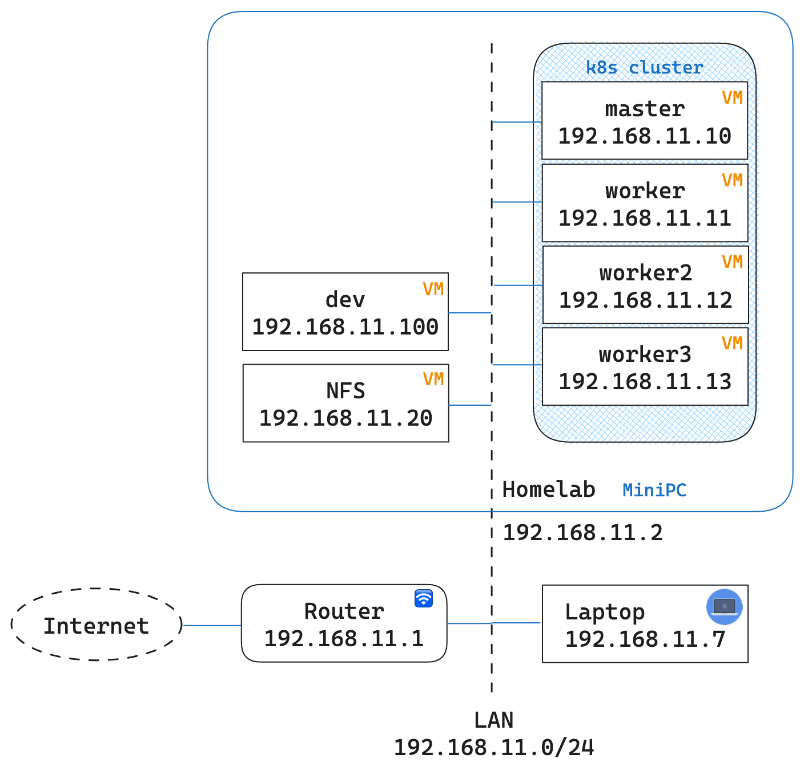
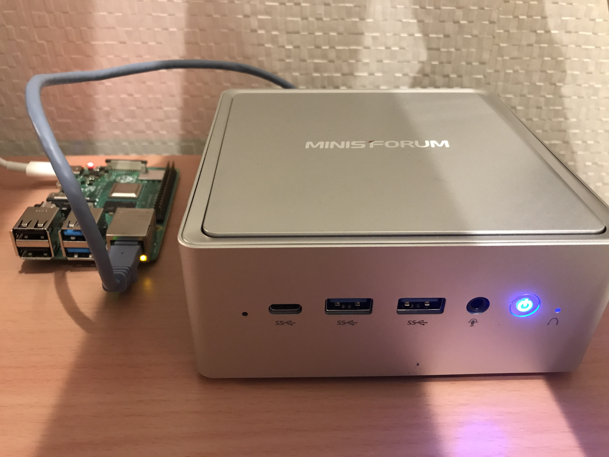

# My homelab

Homelab is a laboratory at home where you can self-host, experiment with new technologies, practice for certifications and so on.

## Quick Links

* [Contents of the Repository](#contents-of-the-repository)
* [Hardware](#hardware)

https://github.com/lisenet/kubernetes-homelab

## Contents of the Repository

* autossh:
* dev:  
  Ubuntu environment for development, experiment.
* kubernetes - 
* monitoring - 
* nfs - 

https://github.com/lisenet/kubernetes-homelab#content-of-the-repository

## Network Diagram and Config

MiniPC has the hostname: `homelab`. VMs by Virtualbox are created on the homelab.

https://github.com/lisenet/kubernetes-homelab#homelab-network-diagram

## Hardware

<table>
    <tr>
        <th>Router</th>
        <th>MiniPC</th>
        <th>Raspi </th>
    </tr>
    <tr>
        <td></td>
        <td></td>
        <td></td>
    </tr>
</table>

* Machine
* Spec

## User interface

Deployed Applicationが一目でわかるようなApplicationを使用する予定

* https://github.com/davidsbond/homelab
* https://github.com/toboshii/hajimari

## Tech stack

<table>
    <tr>
        <th>Logo</th>
        <th>Name</th>
        <th>Description</th>
    </tr>
    <tr>
        <td></td>
        <td><a href="https://kubernetes.io/">Kubernetes</a></td>
        <td>system for automation and management of containerized applications.</td>
    </tr>
    <tr>
        <td></td>
        <td><a href="https://helm.sh/">Helm</a></td>
        <td>package manager for Kubernetes</td>
    </tr>
</table>

* https://github.com/khuedoan/homelab#tech-stack

-------
-------
* https://github.com/khuedoan/homelab#tech-stack
* https://github.com/toboshii/hajimari
* https://github.com/lisenet/kubernetes-homelab#content-of-the-repository
* https://pkg.go.dev/github.com/davidsbond/homelab#section-readme
* https://github.com/awesome-selfhosted/awesome-selfhosted/blob/master/README.md?plain=1

  

**[`^        back to top        ^`](#my-homelab)**

