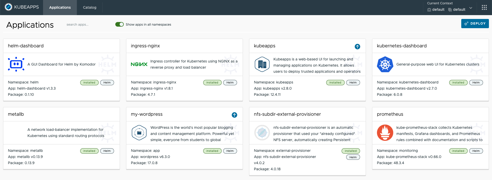

# My homelab

Homelab is a laboratory at home where you can self-host, experiment with new technologies, practice for certifications and so on.

## Quick Links

* [Wiki](#wiki)
* [Contents of the Repository](#contents-of-the-repository)
* [Network Diagram](#network-diagram)
* [Hardware](#hardware)
* [User interface](#user-interface)
* [Tech stack](#tech-stack)

## Wiki

* [WIki: Home](https://github.com/toge510/homelab/wiki)

## Contents of the Repository

* autossh - set-up ssh reverse tunnel with autossh
* dev - development environment
* kubernetes - kubernetes cluster
* monitoring - minitoring stacks with Docker
* nfs - NFS server

## Network Diagram

MiniPC has the hostname: `homelab` (ip address: `192.168.11.2`). VMs by Virtualbox are created on the homelab. Homelab network LAN is `192.168.11.0/24`

## Hardware

### Router: BUFFALO WXR-1900DHP2

### MiniPC: Minisforum NAB6

* Processor: Intel® Core™ i7-12650H Processor, 10 Cores/16 Threads
* Memory: DDR4 Dual channel 32GB
* Storage: M.2 2280 PCIe4.0 SSD ×1 1TB

## User interface

Kubeapps is an Application Dashboard for Kubernetes.  

## Tech stack

<table>
    <tr>
        <th>Name</th>
        <th>Description</th>
    </tr>
    <tr>
        <td><a href="https://ceph.io/">Ceph</a></td>
        <td>Distributed storage system designed to provide excellent performance, reliability, and scalability</td>
    </tr>
    <tr>
        <td><a href="https://www.docker.com/">Docker</a></td>
        <td>Containerization platform</td>
    </tr>
    <tr>
        <td><a href="https://grafana.com/">Grafana</a></td>
        <td>Open-source platform for monitoring and observability</td>
    </tr>
    <tr>
        <td><a href="https://helm.sh/">Helm</a></td>
        <td>Package manager for Kubernetes applications</td>
    </tr>
    <tr>
        <td><a href="https://helm.sh/">Helm Dashboard</a></td>
        <td>Web-based user interface for Helm, the Kubernetes package manager</td>
    </tr>
    <tr>
        <td><a href="https://metallb.universe.tf/">MetalLB</a></td>
        <td>Load balancer for bare metal Kubernetes clusters</td>
    </tr>
    <tr>
        <td><a href="https://prometheus.io/">Prometheus</a></td>
        <td>Open-source monitoring and alerting toolkit</td>
    </tr>
    <tr>
        <td><a href="https://rook.io/">Rook Ceph</a></td>
        <td>Open-source cloud-native storage orchestrator for Ceph storage in Kubernetes</td>
    </tr>
    <tr>
        <td><a href="https://www.vagrantup.com/">Vagrant</a></td>
        <td>Open-source tool for building and managing virtualized development environments</td>
    </tr>
    <tr>
        <td><a href="https://kubeapps.com/">Kubeapps</a></td>
        <td>Web-based Kubernetes application dashboard and marketplace</td>
    </tr>
    <tr>
        <td><a href="https://kubernetes.io/">Kubernetes</a></td>
        <td>Open-source container orchestration platform for automating the deployment, scaling, and management of containerized applications</td>
    </tr>
    <tr>
        <td><a href="https://kubernetes.io/docs/concepts/services-networking/ingress-controllers/">Ingress Nginx</a></td>
        <td>Kubernetes Ingress controller using Nginx</td>
    </tr>
</table>

 

**[`^        back to top        ^`](#my-homelab)**

