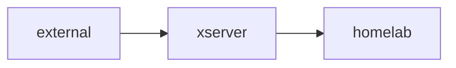

## Setting up ssh reverse tunnel with autossh

Use reverse ssh tunnel for access homelab via xserver from the external environment.

* `homelab`: 192.168.11.2 (private IP address)
* `xserver`: 183.XXX.XX.X (public IP address)



To access homelab from the xserver, reverse ssh tunnel needs to be established.

### `autossh`  

Run, monitor and restart SSH connections.  
Auto-reconnects to keep port forwarding tunnels up. Accepts all `ssh` flags.  
More information: [https://www.harding.motd.ca/autossh](https://www.harding.motd.ca/autossh).

Run the following command to install.

```
sudo apt install -y autossh
```

### Systemd Service (`autossh.service`)

The following commands can update `autossh.service` and restart it.

```
sudo cp ~/homelab/autossh/autossh.service /etc/systemd/system/
sudo systemctl daemon-reload
sudo systemctl restart autossh.service
```

### _references_

* [Setting Up autossh to Maintain a Reverse Tunnel](https://cnly.github.io/2018/08/16/setting-up-autossh-to-maintain-a-reverse-tunnel-ssh-server-having-a-dynamic-ip-address.html)
* [How to access my homelab from external environment](https://github.com/toge510/homelab/wiki/How-to-access-my-homelab-from-external-environment)