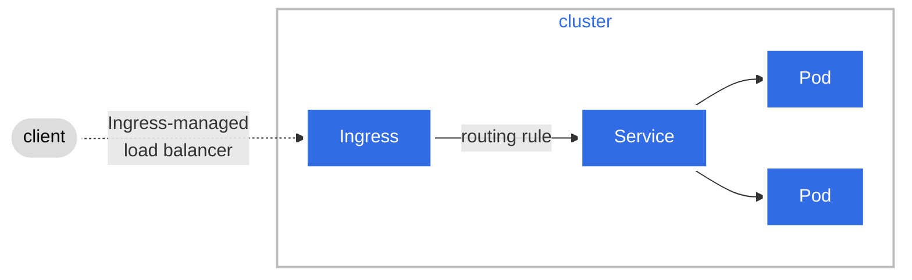
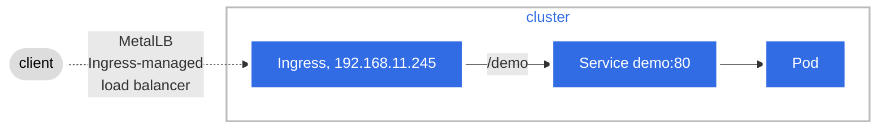

## Ingress Resource

[Ingress](https://kubernetes.io/docs/reference/generated/kubernetes-api/v1.27/#ingress-v1-networking-k8s-io) exposes HTTP and HTTPS routes from outside the cluster to services within the cluster. Traffic routing is controlled by rules defined on the Ingress resource.

We can define Ingress resource as an Ingress Resource like this.

A fanout configuration routes traffic from a single IP address to more than one Service, based on the HTTP URI being requested. 



An Ingress may be configured to give Services externally-reachable URLs, load balance traffic, terminate SSL / TLS, and offer name-based virtual hosting.

## Ingress Controller

You must have an [Ingress controller](https://kubernetes.io/docs/concepts/services-networking/ingress-controllers) to satisfy an Ingress. Only creating an Ingress resource has no effect.

You may need to deploy an Ingress controller such as [ingress-nginx](https://kubernetes.github.io/ingress-nginx/deploy/). You can choose from a number of [Ingress controllers](https://kubernetes.io/docs/concepts/services-networking/ingress-controllers).

Deply Ingress-Nginx Controller with Helm

```
helm install ingress-nginx ingress-nginx/ingress-nginx --version 4.7.1 --create-namespace --namespace ingress-nginx -f custom-values.yaml 
```

Use `custom-values.yaml` so that `192.168.11.245` can be assigned to Ingress controller service as an EXTERNAL-IP by MetalLB (take a look at `metallb/README.md`).

```
controller:
  service:
    annotations: 
      metallb.universe.tf/loadBalancerIPs: 192.168.11.245
```

Run the following command to check that `192.168.11.245` can be assigned to Ingress controller service as an EXTERNAL-IP

```
$ kubectl -n ingress-nginx get svc ingress-nginx-controller
NAME                       TYPE           CLUSTER-IP    EXTERNAL-IP      PORT(S)                      AGE
ingress-nginx-controller   LoadBalancer   10.97.22.81   192.168.11.245   80:32567/TCP,443:31270/TCP   24m
```

## Testing

```
kubectl create deployment demo --image=httpd --port=80
kubectl expose deployment demo
kubectl create ingress demo --class=nginx \
  --rule="/demo=demo:80" \
  --annotation="nginx.ingress.kubernetes.io/rewrite-target=/"
```



You can access your deployment using curl.

```
goto@homelab:~$ curl 192.168.11.245/demo
<html><body><h1>It works!</h1></body></html>
```

Clean-up

```
kubectl delete svc demo
kubectl delete deploy demo
kubectl delete ingress demo
```

### _References_

* [Ingress](https://kubernetes.io/docs/concepts/services-networking/ingress/)
* [Pairing MetalLB and nginx-ingress](https://www.adaltas.com/en/2022/09/08/kubernetes-metallb-nginx/#pairing-metallb-and-nginx-ingress)
* [Kubernetes Ingress Tutorial For Beginners](https://devopscube.com/kubernetes-ingress-tutorial/)
* [artifacthub: Ingress Nginx](https://artifacthub.io/packages/helm/ingress-nginx/ingress-nginx)