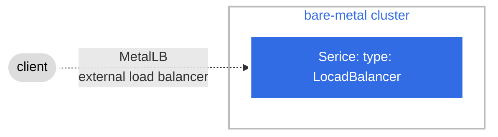

# MetalLB

* Service type: LoadBalancer can expose the service externally using an external load balancer.
* Kubernetes does not directly offer a load balancing component for bare-metal clusters (that do not run on a supported cloud provider). If you’re not running on a supported IaaS platform (GCP, AWS, Azure…), LoadBalancers will remain in the “pending” state indefinitely when created.
  ```
  goto@homelab:~/homelab/kubernetes/test$ kubectl get svc nginx-svc 
  NAME        TYPE           CLUSTER-IP      EXTERNAL-IP   PORT(S)        AGE
  nginx-svc   LoadBalancer   10.107.74.166   <pending>     80:30080/TCP   16m
  ```
* [MetalLB](https://metallb.universe.tf/) provides a network load-balancer implementation for bare-metal clusters, effectively allowing the usage of LoadBalancer Services.



## Deploy with Helm

```
helm install metallb metallb/metallb --version 0.13.9 --create-namespace --namespace metallb
```

### Defining the IPs to assign to the LoadBalancer Services

In order to assign an IP to the services, MetalLB must be instructed to do so via the IPAddressPool CR(custom resource).

```
apiVersion: metallb.io/v1beta1
kind: IPAddressPool
metadata:
  name: first-pool
  namespace: metallb
spec:
  addresses:
  - 192.168.1.240-192.168.1.250
```

### L2 Configuration

Layer 2 mode does not require the IPs to be bound to the network interfaces of your worker nodes. It works by responding to ARP requests on your local network directly, to give the machine’s MAC address to clients.

In order to advertise the IP coming from an IPAddressPool, an L2Advertisement instance must be associated to the IPAddressPool.

```
apiVersion: metallb.io/v1beta1
kind: L2Advertisement
metadata:
  name: example
  namespace: metallb-system
spec:
  ipAddressPools:
  - first-pool
```

You can confirm the following ip addresses set as `IPAddressPool` can be assigned to the LoadBalancer services automatically.

```
goto@homelab:~/homelab/kubernetes$ kubectl get svc nginx-svc nginx-svc2 
NAME         TYPE           CLUSTER-IP      EXTERNAL-IP      PORT(S)        AGE
nginx-svc    LoadBalancer   10.108.14.108   192.168.11.240   80:31864/TCP   92m
nginx-svc2   LoadBalancer   10.105.43.78    192.168.11.241   80:30543/TCP   16m
```

## How it works

The deployment of MetalLB on the control-plane creates pods for the following resources:

* MetalLB controller:  
  The controller pod manages the load-balancer configuration by using one of the IP address pools provided by the user, and distributing the IP addresses from the selected pool to the load-balancer type services.
* MetalLB speakers:  
  The speaker pods are deployed with their corresponding listeners and role bindings. Each worker node receives a speaker pod, and one is elected using the memberlist to be responsible for routing the traffic. If the node containing the pod is down, another pod in another node is then elected to take its place.

### Requesting Specific IPs

MetalLB respects the spec.loadBalancerIP parameter, so if you want your service to be set up with a specific address, you can request it by setting that parameter.

```
apiVersion: v1
kind: Service
metadata:
  name: nginx
  annotations:
    metallb.universe.tf/loadBalancerIPs: 192.168.1.100
spec:
  ports:
  - port: 80
    targetPort: 80
  selector:
    app: nginx
  type: LoadBalancer
```

## MetalLB + Ingress

Thanks to metalLB, you can deploy a service and make it accessible outside of the cluster.  
However, metalLB needs **one IP address per one service** (it can't make every service accessible from a single IP address). 

To make every service accessible from a single IP address, you have to use Ingress (take a look at `ingress_controller/README.md`).

## _References_

* [artifacthub: metalLB](https://artifacthub.io/packages/helm/metallb/metallb/)
* [Installation](https://metallb.universe.tf/installation/)
* [Layer2 Configuration](https://metallb.universe.tf/configuration/)
* [Network addon compatibility](https://metallb.universe.tf/installation/network-addons/)
* [Requesting Specific IPs](https://metallb.universe.tf/usage/#requesting-specific-ips)
* [A pure software solution: MetalLB](https://github.com/kubernetes/ingress-nginx/blob/main/docs/deploy/baremetal.md#a-pure-software-solution-metallb)
* [Ingresses and Load Balancers in Kubernetes with MetalLB and nginx-ingress](https://www.adaltas.com/en/2022/09/08/kubernetes-metallb-nginx/)