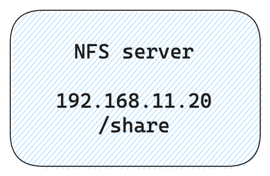

# NFS (Network File System)

NFS allows a system to share directories and files with others over a network. 

## NFS server

Create NFS server in virtualbox with vagrant. Use IP address on the homelab network(`192.168.11.0/24`).

```
vagrant up
```

<div align="center">

</div>

## NFS client (homelab)

To confirm if NFS server works correctly, configure NFS client on homelab.

Run the following command.

```
sudo apt install nfs-common -y
```

Use the mount command to mount a shared NFS directory from homelab.

```
sudo mount 192.168.11.20:/share /share/
```

Unomount command

```
sudo umount /share
```

## __References__

* [Wiki: Set‐up an NFS server](https://github.com/toge510/homelab/wiki/Set%E2%80%90up-an-NFS-server)